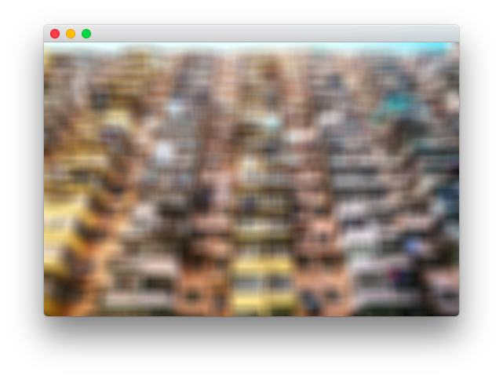
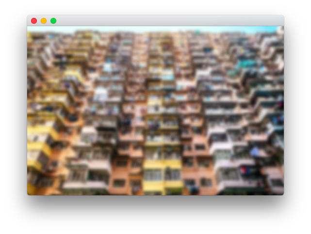
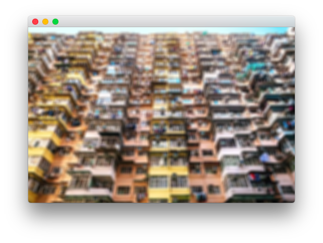

# Blur Shaders

## Sprite Kit and Blur
**SpriteKit** provides developers with `SKEffectNode` which could be used with `CIFilter`. This combination allows one to blur the child nodes. However, it would be extremely slow for the case of dynamic objects. 
Another way of blurring is `SKShader`. It process the texture with GPU power, that's why it is fast. Moreover, custom blur could be faster than the build-ins because of some hits and tricks for the certain needs.

## Uniforms
 
- `float u_radius` - blur radius
- `float u_step` - the multiplier of the radius
- `float u_sigma` - sigma in Normal Distribution (default `u_radius  / 3.0`)
- `vec2 u_sprite_size` - size of a sprite

## How to use
In order to make the fast Gaussian Blur with effective radius of 9 pixels, we choose `u_radius=3.0` and `u_step=3.0`.

```swift
let node = self.childNode(withName: "node") as! SKSpriteNode
let shader = SKShader(fileNamed: "blur_gauss.fsh")
let sizeVec = vector_float2(Float(node.frame.size.width),
                            Float(node.frame.size.height))
shader.uniforms = [
    SKUniform(name: "u_step", float: 3.0),
    SKUniform(name: "u_radius", float: 3.0),
    SKUniform(name: "u_sprite_size", vectorFloat2: sizeVec)
]
node.shader = shader
```

## Shaders

There are 2 types of blur shaders. 

- Dynamic blurring ([blur_gauss.fsh][blur_gauss]). The Gaussian kernel is computed in runtime. It could be slow in case of big `u_radius`. However, the similar effect could be obtained by decreasing the blur radius  `u_radius` while increasing the step `u_step` such that the effective blur radius `u_radius * u_step` keeps the same.
- Precomputed blurring ([blur_g5x5.fsh][blur_g5x5], [blur_g7x7.fsh][blur_g7x7]). The Gaussian kernels are already computed. Therefore, the whole processing is performed faster. Box blurring ([blur_box.fsh][blur_box]) is kind of precomputed blurring with kernel of all ones. 


| Shader | Image  |
|:------:|:------:|
|[blur_box.fsh][blur_box]. `u_radius=10.0; u_step=1.0`||
|[blur_box.fsh][blur_box]. `u_radius=5.0; u_step=2.0`||
|[blur_gauss.fsh][blur_gauss]. `u_radius=10.0; u_step=1.0`||
|[blur_gauss.fsh][blur_gauss]. `u_radius=5.0; u_step=2.0`||
|[blur_g5x5.fsh][blur_g5x5]. `u_radius=5.0; u_step=2.0`||
|[blur_g7x7.fsh][blur_g7x7]. `u_radius=7.0; u_step=10.0/7.0`||


## Animating the blur


The blur effect could be animated in different ways. And the most complicated and beautiful one is the animation of the blur radius. In **SpriteKit** is implemented with `SKAttribute`.

```swift
shader.attributes = [SKAttribute(name: "u_radius", type: .float)]
node.setValue(SKAttributeValue(float: 0.0), forAttribute: "u_radius")
        
let blur = SKAction.customAction(withDuration: 2.0) { (aNode, time) in
    let sprite = aNode as! SKSpriteNode 
    let value = SKAttributeValue(float: 20.0 * Float(time))
    sprite.setValue(value, forAttribute: "u_radius")
}
    
let deblur = SKAction.customAction(withDuration: 2.0) { (aNode, time) in
    let sprite = aNode as! SKSpriteNode
    let value = SKAttributeValue(float: 20.0 * Float(2.0 - time))
    sprite.setValue(value, forAttribute: "u_radius")
}
let seq = SKAction.sequence([blur, deblur])
node.run(seq)
```


[blur_box]: https://github.com/ISosnovik/shaders/blob/master/blur/code/blur_box.fsh
[blur_gauss]: https://github.com/ISosnovik/shaders/blob/master/blur/code/blur_gauss.fsh
[blur_g5x5]: https://github.com/ISosnovik/shaders/blob/master/blur/code/blur_g5x5.fsh
[blur_g7x7]: https://github.com/ISosnovik/shaders/blob/master/blur/code/blur_g7x7.fsh
